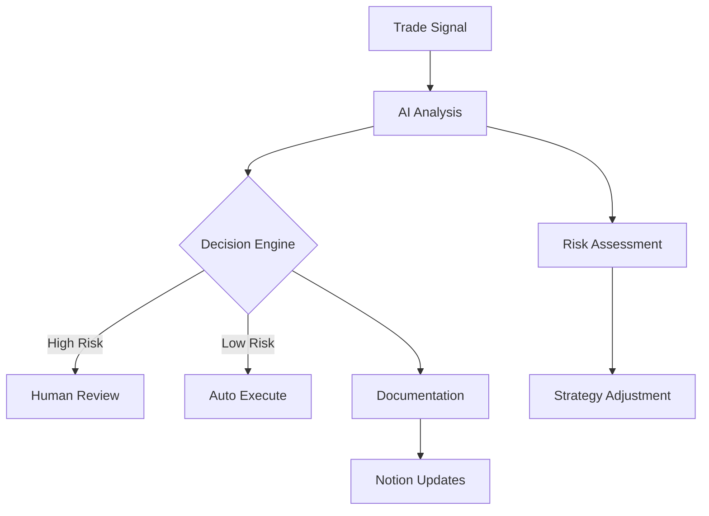
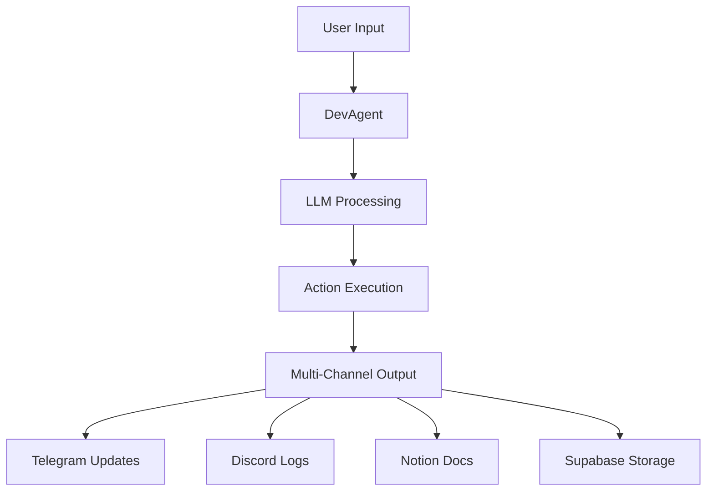

# 🔧 Technical Architecture Guide

## Core Components

### Frontend Dashboard (Next.js + Tailwind)

- Real-time trading dashboard
- Subscription management interface
- User authentication and profile management
- Trading history and analytics

### Bot Infrastructure

- Telegram bot for instant commands and notifications
- Discord bot for community updates and bulk notifications
- Secure authentication via Supabase
- Rate limiting and abuse prevention

### AI Integration

#### Core AI Components
- LangChain AgentExecutor for trade analysis and orchestration
- OpenRouter for LLM routing and payment proxy
- Ollama LLM for local AI processing
- Gemini for code review and analysis
- Automated trading insights and recommendations

#### AI Operations
- Real-time market analysis
- Code quality enforcement
- Risk assessment
- Performance monitoring
- Documentation generation
- Trading strategy validation

#### Integration Points

### Database & Auth

- Supabase for user management and auth
- JWT-based authentication
- Role-based access control
- Real-time subscription status tracking

### Payment Processing

- Stripe integration via OpenRouter proxy
- Secure webhook handling
- Subscription tier management
- Automated payment retry logic

## System Architecture

### Data Flow

### Communication Channels

- **Telegram**: Direct user communication
- **Discord**: Community updates
- **Web UI**: Dashboard interface
- **Supabase**: Data persistence

### Security Measures

- JWT token validation
- Rate limiting
- Role-based access
- Secure payment processing
