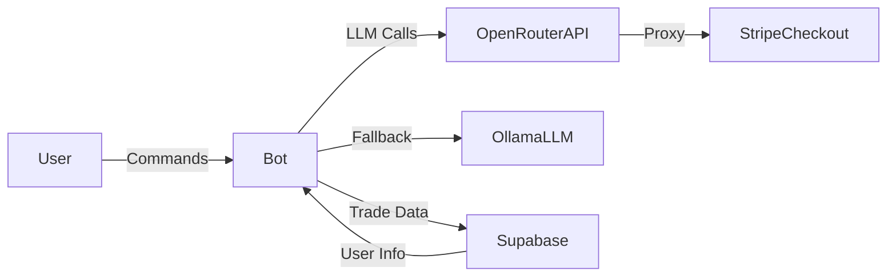
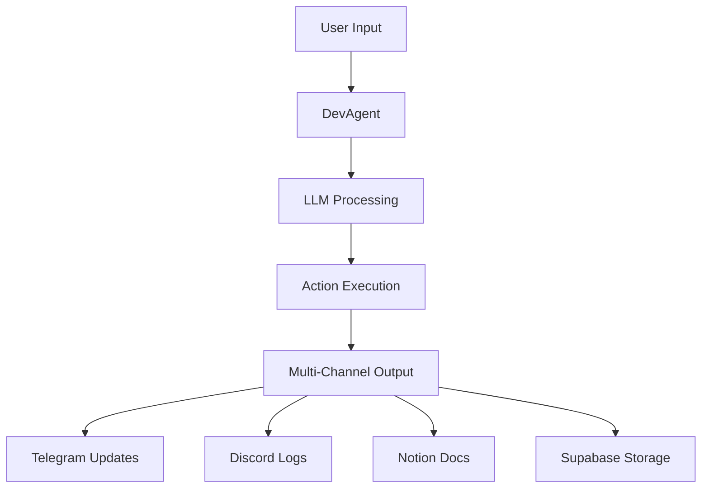

# 🧠 Automation with Ag — Micro-SaaS Trading Bot MVP Blueprint

---

## 🚀 Project Overview

- **Binance Spot micro-trading bot** with dip-buy & gain-sell logic.
- Multi-interface control: Web UI (Next.js + Tailwind), Telegram & Discord bots.
- AI-powered Ops with **LangChain AgentExecutor** + **OpenRouter (self-hosted)** + **Ollama LLM** integration.
- Secure user auth & subscription tiers via **Supabase**.
- Stripe payment flow proxied through OpenRouter for secure, seamless upgrades.
- CI/CD pipeline with GitHub Actions, deploy on **Fly.io**.
- Retry logic, error handling, and monitoring hooks for resilient uptime.

---

## 📁 Project Structure

```bash
automation-with-ag-bot/
├── apps/
│   ├── web-ui/                # Next.js + Tailwind dashboard UI
│   ├── telegram-bot/          # Telegram bot Python handlers + commands
│   └── discord-bot/           # Discord bot commands & alerts
├── packages/
│   ├── core/                  # Core trade logic, utils, API clients
│   └── ai-agents/             # Ollama + OpenRouter agent logic (LangChain)
├── infra/
│   ├── docker/                # Dockerfiles, container configs
│   └── fly/                   # Fly.io deployment config (fly.toml)
├── scripts/                   # CLI scripts (trade runner, db cleanup)
├── tests/                     # Unit + integration tests (pytest)
├── .github/workflows/         # CI/CD workflows (GitHub Actions)
├── config/                    # Configs: OpenRouter, supabase, stripe, secrets.env
├── README.md
└── Dockerfile
```

---

## 🔗 Core Tech Stack

| Technology            | Role                                              |
|-----------------------|---------------------------------------------------|
| Next.js + Tailwind    | Frontend dashboard & API routes                   |
| Python + LangChain    | Bot commands & AI AgentExecutor orchestration     |
| OpenRouter (self-host)| LLM routing & Stripe proxy API                    |
| Ollama LLM            | Local AI fallback & trade insight                 |
| Supabase              | Auth, user management, subscription storage       |
| Stripe                | Payment gateway (Checkout & webhooks)             |
| Fly.io                | Cloud deployment (24/7 edge uptime)               |
| GitHub Actions        | CI/CD pipeline for tests, builds & deploys        |

---

## 🧩 AI Agent + OpenRouter Flow

```mermaid
graph LR
  User --_>|Command| Bot
  Bot --_>|LLM Call| OpenRouterAPI
  OpenRouterAPI --_>|Proxy| StripeProxy
  Bot --_>|Fallback| OllamaLLM
  Bot --_>|Reads/Writes| SupabaseDB
```

---

## 💳 Stripe Payment & Subscription Flow

- **/upgrade** or “Upgrade” UI button → Bot calls OpenRouter API → Stripe Checkout session.
- Stripe collects payment → Webhook hits `/api/webhook` → Supabase subscription status updated.
- **/status** command or UI shows current tier & expiry.
- **/downgrade** command triggers Customer Portal or direct downgrade.
- Retry logic with exponential backoff on webhook failures.
- **/retry-payment** for manual retry of failed charges.

---

## 🔐 Secure Auth & Subscription Module

- Supabase Auth (JWT) for web & API routes.
- Telegram Login Widget or token linking for bot auth.
- Role-based access: `free`, `pro`, `whale`.
- Bot & UI validate session & subscription before actions.
- Rate limiting on commands & endpoints.

---

## 🤖 Telegram & Discord Bot Commands

| Command          | Description                               |
|------------------|-------------------------------------------|
| `/status`        | Show current subscription tier & expiration |
| `/upgrade`       | Return Stripe Checkout URL for upgrade    |
| `/downgrade`     | Confirm & perform subscription downgrade  |
| `/trades`        | List last 5 executed trades               |
| `/retry-payment` | Retry a failed Stripe payment             |

---

## ⚙️ Retry Logic & Error Handling

- **Webhook retries**: 3× exponential backoff.
- **Bot retries**: catch errors, notify user, allow manual retry.
- **Trade execution**: circuit-breaker, timeout + retry.
- **Logging**: structured logs, Sentry for critical alerts.

---

## 🖥️ Local Supabase Testing

For offline development and database iteration, use the Supabase CLI with Docker:

1. **Install CLI (once)**

    ```bash
    npm install -g supabase
    ```

2. **Bootstrap local project** (creates `supabase/` folder)

    ```bash
    supabase init
    ```

3. **Start local Supabase services**

    ```bash
    supabase start
    ```

    - Postgres → `localhost:5432`
    - REST API → `http://localhost:54321`
    - Studio → `http://localhost:54323`

4. **Apply migrations & seed data**

    ```bash
    supabase db push
    ```

**Env vars for local testing:**

```
SUPABASE_URL=http://localhost:54321
SUPABASE_ANON_KEY=<anon_key_from_supabase/config.toml>
```

---

## 🚀 Deployment Guide (Fly.io + Docker)

1. **Set secrets on Fly.io:**

    ```bash
    fly secrets set \
# 🧠 Automation with Ag — Micro-SaaS Trading Bot MVP Blueprint

---

## 🚀 Project Overview

- **Binance Spot micro‑trading bot** with dip‑buy & gain‑sell logic  
- Multi‑interface control: Web UI (Next.js + Tailwind), Telegram & Discord bots  
- AI‑powered Ops with **LangChain AgentExecutor** + **OpenRouter (self‑hosted)** + **Ollama LLM** integration  
- Secure user auth & subscription tiers via **Supabase**  
- Stripe payment flow proxied through OpenRouter for secure, seamless upgrades  
- CI/CD pipeline with GitHub Actions, deploy on **Fly.io**  
- Retry logic, error handling, and monitoring hooks for resilient uptime  

---

## 📁 Project Structure

```bash
automation-with-ag-bot/
├── apps/
│   ├── web-ui/                # Next.js + Tailwind dashboard UI
│   ├── telegram-bot/          # Telegram bot Python handlers + commands
│   └── discord-bot/           # Discord bot commands & alerts
├── packages/
│   ├── core/                  # Core trade logic, utils, API clients
│   └── ai-agents/             # Ollama + OpenRouter agent logic (LangChain)
├── infra/
│   ├── docker/                # Dockerfiles, container configs
│   └── fly/                   # Fly.io deployment config (fly.toml)
├── scripts/                   # CLI scripts (trade runner, db cleanup)
├── tests/                     # Unit + integration tests (pytest)
├── .github/workflows/         # CI/CD workflows (GitHub Actions)
├── config/                    # Configs: OpenRouter, supabase, stripe, secrets.env
├── README.md
└── Dockerfile
```

---

## 🔧 Extended Folder Structure Snapshot

```bash
automation-with-ag-bot/
├── app/
│   └── components/SubscribeButton.tsx
├── pages/
│   ├── api/
│   │   ├── auth/
│   │   │   └── [...nextauth].ts
│   │   ├── create-checkout-session.ts
│   │   ├── subscription-status.ts
│   │   └── webhook.ts
│   └── auth/telegram-login.ts
├── telegram_bot/
│   ├── commands/
│   │   ├── auth.ts
│   │   └── payment.ts
│   └── index.ts
├── lib/
│   ├── db.ts
│   ├── payments.ts
│   ├── stripeClient.ts
│   ├── authGuard.ts
│   └── your_tools.ts
├── tests/
│   ├── test_tools.py
│   ├── test_agent_executor.py
│   ├── test_prompts.py
│   └── test_agent_evals.py
├── .github/workflows/
│   ├── ci.yml
│   └── staging-deploy.yml
├── Dockerfile
├── fly.toml
├── config.json
├── package.json
├── tsconfig.json
├── README.md
└── docs/
    └── project-doc.md
```

---

## 🔗 Core Tech Stack

| Technology            | Role                                              |
|-----------------------|---------------------------------------------------|
| Next.js + Tailwind    | Frontend dashboard + API routes                   |
| Python + LangChain    | Bot commands + AI AgentExecutor logic             |
| OpenRouter (self-hosted)| Central LLM router, proxy for Stripe payments   |
| Ollama LLM            | Local AI agent fallback & trade insights          |
| Supabase              | Auth, user management, subscription data          |
| Stripe                | Payment gateway via OpenRouter proxy              |
| Fly.io                | Cloud deployment (24/7 uptime)                    |
| GitHub Actions        | CI/CD pipeline with tests & deploy                |

---

## 🧩 AI Agent + OpenRouter Flow Diagram



---

## 💳 Stripe Payment & Subscription Flow

- User triggers `/upgrade` or clicks upgrade on UI.
- Bot calls OpenRouter proxy API to create Stripe checkout session securely.
- Stripe Checkout collects payment & sends webhook to update Supabase subscription status.
- Bot verifies subscription on each command (e.g. `/status`, `/trade`) via Supabase.
- Retry & error handling logic for payment failures with exponential backoff.
- `/retry-payment` command lets user manually retry failed payments.

---

## 🔐 Secure Auth & Subscription Module

- Auth handled by Supabase (JWT tokens).
- Role-based access: `free`, `pro`, `whale`.
- Each bot command validates user JWT & subscription status before execution.
- UI syncs session with Supabase for real-time plan visibility.
- Rate limiting on bot commands & API routes for abuse prevention.

---

## 🤖 Telegram & Discord Bot Commands

| Command          | Description                                 |
|------------------|---------------------------------------------|
| `/status`        | Show current subscription tier and expiry    |
| `/upgrade`       | Return Stripe Checkout URL for payment       |
| `/downgrade`     | Revert to free tier, disable pro features    |
| `/trades`        | Show last 5 live trades and bot activity     |
| `/retry-payment` | Retry failed Stripe payment                  |

---

## ⚙️ Retry Logic & Error Handling

- Webhook failures retried 3x with exponential backoff.
- Bot logs persistent errors and notifies users to manually retry.
- On retry command, bot re-checks Stripe payment intent and triggers new checkout if needed.

---

## 🖥️ Local Supabase Testing

For offline dev & database iteration, use the Supabase CLI + Docker:

```bash
# 1. Install CLI (once)
npm install -g supabase

# 2. Bootstrap local project (creates supabase/ folder)
supabase init

# 3. Start local Supabase services
supabase start
# - Postgres  → localhost:5432
# - REST API → http://localhost:54321
# - Studio    → http://localhost:54323

# 4. Apply migrations & seed data
supabase db push

# 5. Reset DB (if needed)
supabase db reset

# 6. Stop services when done
supabase stop
```

Env vars for local testing:

```
SUPABASE_URL=http://localhost:54321
SUPABASE_ANON_KEY=<anon_key_from_supabase/config.toml>
```

Point your app, bots, and tests at this local instance—iterate fast, then push your migrations and config up to managed Supabase for staging/production.

---

## 🚀 Deployment Guide (Fly.io + Docker)

Set secrets on Fly.io:

```bash
fly secrets set \
      SUPABASE_URL="..." \
      SUPABASE_KEY="..." \
      STRIPE_KEY="..." \
      TELEGRAM_TOKEN="..." \
      RUNNER_KEY="YOUR_SECRET_KEY"
```

Build and deploy Docker container with OpenRouter + AgentExecutor + Bot:

```bash
fly deploy --remote-only
```

CI/CD auto-deploy triggered on GitHub main branch push.

---

## 🧪 Testing & CI/CD Pipeline

- Unit tests with pytest for bot commands & AI agents.
- LangChain standard tests for AgentExecutor tools.
- GitHub Actions workflow for linting, tests, AI code reviews (Gemini CLI).
- Automated deployment on successful pipeline pass.

---

## 🧠 Sprint Model & Roadmap

| Sprint | Focus                                      |
|--------|---------------------------------------------|
| 1      | Auth + Bot infra setup (Telegram/Discord)   |
| 2      | Stripe payment integration + Supabase roles |
| 3      | Web UI Dashboard + Live Trade View          |
| 4      | Ollama + OpenRouter LLM agent integration   |
| 5      | CI/CD automation + production deploy        |

---

## 💰 Architecture Summary

Micro-services with AI agent orchestration, fully modular and designed to scale horizontally. Zero dependency on third parties for LLM hosting if self-hosted OpenRouter is deployed. Payment flows routed securely, user auth fully centralized. Designed to run efficiently on a $5–15/month budget using Fly.io + Supabase.

---

## 🤖 System Architecture Details

### Service Integration Channels

- **Telegram**: Your AI's private hotline for instant communication
- **Discord**: Team-wide announcements and updates
- **Notion**: Long-term knowledge storage and documentation
- **Supabase**: Secure storage for all agent interactions

### Core System Capabilities

- Real-time trade analysis and suggestions
- Automated code review and optimization
- Error detection and recovery
- Performance monitoring and alerts

### System Data Flow



### Essential Features

- Instant response via Telegram
- Automated trade strategy analysis
- Real-time market monitoring
- Self-healing error handling
- Comprehensive logging and analytics


---

## 🤖 DevAgent Integration Overview

The system is powered by an AI DevAgent that acts as your intelligent assistant:

### Communication Channels
- **Telegram**: Your AI's private hotline for instant communication
- **Discord**: Team-wide announcements and updates
- **Notion**: Long-term knowledge storage and documentation
- **Supabase**: Secure storage for all agent interactions

### Agent Capabilities
- Real-time trade analysis and suggestions
- Automated code review and optimization
- Error detection and recovery
- Performance monitoring and alerts

### Data Flow


### Key Features
- Instant response via Telegram
- Automated trade strategy analysis
- Real-time market monitoring
- Self-healing error handling
- Comprehensive logging and analytics

---

## 🔗 Recommended URLs

- [OpenRouter Docs](https://openrouter.ai/docs)
- [Ollama Docs](https://ollama.com/docs)
- [Supabase Auth](https://supabase.com/docs/guides/auth)
- [Stripe Dashboard](https://dashboard.stripe.com/)
- [Fly.io Docs](https://fly.io/docs/)
- [LangChain](https://docs.langchain.com/)

---

## ✅ MVP Feature Checklist

- [ ] Core dip/gain trading logic
- [ ] Web UI + API routes (Next.js)
- [ ] Telegram & Discord bots with secure auth
- [ ] Stripe payment & subscription commands
- [ ] OpenRouter & Ollama LLM agent integration
- [ ] Retry & error-handling flows
- [ ] CI/CD pipeline & Fly.io deployment

---

*Built with ROI-first hustle energy by Ag.*
*Let’s ship this empire, one commit at a time. 🚀*
    ```

2. **Build & deploy:**

    ```bash
    fly deploy --remote-only
    ```

CI/CD auto-deploys on `main` branch push via GitHub Actions.

---

## 🧪 Testing & CI/CD Pipeline

- **Unit tests (pytest)** for tools & agents.
- **PromptWatch** for prompt template regression.
- **LangSmith + OpenEvals** for system-level correctness.
- **GitHub Actions**: `ci.yml` for tests & lint, `fly-deploy.yml` for staging/prod.

---

## ✅ MVP Feature Checklist

- [ ] Core dip/gain trading logic
- [ ] Web UI + API routes (Next.js)
- [ ] Telegram & Discord bots with secure auth
- [ ] Stripe payment & subscription commands
- [ ] OpenRouter & Ollama LLM agent integration
- [ ] Retry & error-handling flows
- [ ] CI/CD pipeline & Fly.io deployment

---

*Built with ROI-first execution by Ag.*
*Let’s ship this empire, one commit at a time. 🚀*
