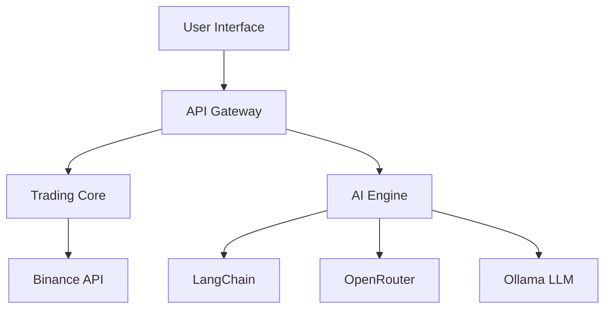

# Binance Trading Bot with AG

**AI-Powered Trading Bot for Binance | Built with Modern Tech Stack**

[Demo](https://your-demo-link.com) · [Documentation](docs/) · [Report Bug](issues) · [Request Feature](issues)

---

## 🎯 Overview

> A modern, AI-powered trading bot that automates Binance spot trading with advanced risk management and multi-platform control.

### Key Capabilities

- 🤖 **Smart Trading**: AI-driven trade decisions using LangChain + Ollama
- 📱 **Multi-Platform**: Access via Web, Telegram, or Discord
- 🔒 **Enterprise Security**: Role-based access with Supabase
- 💳 **Monetization Ready**: Built-in Stripe subscription system
- 📊 **Real-time Analytics**: Live trading insights and reporting

An advanced Binance trading bot that leverages artificial intelligence for automated trading strategies:

- **Core**: Binance Spot micro-trading bot with dip-buy & gain-sell logic
- **Interface**: Multi-platform control via Web UI, Telegram & Discord
- **AI Integration**: LangChain + OpenRouter + Ollama LLM for smart decisions
- **Security**: Role-based access control with Supabase authentication
- **Payments**: Stripe integration for subscription management
- **Deployment**: Automated CI/CD with GitHub Actions & Fly.io

## 🔑 Key Features

- ✨ Advanced trading algorithms with AI assistance
- 🌐 Cross-platform accessibility (Web, Telegram, Discord)
- 🤖 AI-powered trading insights and risk management
- 🔒 Secure authentication and role-based access
- 💳 Tiered subscription system with Stripe
- 📊 Real-time trading analytics and reporting
- 🔄 Automated deployment and scaling
- 📱 Mobile-first responsive dashboard

## 🏗 Architecture

### System Components

### Directory Structure
\`\`\`bash
binance-bot/
├── apps/
│   ├── web/              # Next.js frontend
│   ├── api/              # FastAPI backend
│   └── bots/             # Telegram & Discord bots
├── core/
│   ├── trading/          # Trading logic
│   ├── ai/               # AI components
│   └── security/         # Auth & encryption
├── infrastructure/
│   ├── docker/           # Container configs
│   └── terraform/        # IaC scripts
└── tools/                # CLI & utilities
\`\`\`

## 🛠 Tech Stack

| Category | Technologies |
|----------|-------------|
| Frontend | Next.js, TailwindCSS, React Query |
| Backend | Python, FastAPI, WebSocket |
| Database | Supabase (PostgreSQL) |
| AI/ML | LangChain, OpenRouter, Ollama |
| DevOps | Docker, GitHub Actions, Fly.io |
| Monitoring | Custom Logging, Metrics |
| Payment | Stripe |

## 📥 Installation

1. **Clone Repository**
   \`\`\`bash
   git clone https://github.com/Gmpho/ag-bot-automation-with-ag.git
   cd ag-bot-automation-with-ag
   \`\`\`

2. **Install Dependencies**
   \`\`\`bash
   # Backend
   python -m venv venv
   source venv/bin/activate  # or .\venv\Scripts\activate on Windows
   pip install -r requirements.txt

   # Frontend
   cd apps/web
   npm install
   \`\`\`

3. **Environment Setup**
   \`\`\`bash
   cp .env.example .env
   # Configure your environment variables
   \`\`\`

## ⚙️ Configuration

1. **Required Environment Variables**
   \`\`\`env
   BINANCE_API_KEY=your_api_key
   BINANCE_API_SECRET=your_api_secret
   SUPABASE_URL=your_supabase_url
   SUPABASE_KEY=your_supabase_key
   STRIPE_SECRET_KEY=your_stripe_key
   \`\`\`

2. **Optional Settings**
   - Trading parameters in \`config/trading.yml\`
   - AI model settings in \`config/ai.yml\`
   - Notification preferences in \`config/notifications.yml\`

## 🚀 Usage

### Web Dashboard
1. Start the frontend: \`npm run dev\`
2. Start the backend: \`python main.py\`
3. Access at \`http://localhost:3000\`

### Telegram Bot
- Start: \`python bots/telegram/main.py\`
- Commands:
  - \`/start\` - Initialize bot
  - \`/status\` - Check account status
  - \`/trade\` - View active trades

### Discord Bot
- Start: \`python bots/discord/main.py\`
- Available in your Discord server after setup

## 👩‍💻 Development

### Local Development
1. Start local services:
   \`\`\`bash
   docker-compose up -d
   \`\`\`

2. Run migrations:
   \`\`\`bash
   supabase db push
   \`\`\`

3. Start development servers:
   \`\`\`bash
   # Frontend
   npm run dev

   # Backend
   uvicorn main:app --reload
   \`\`\`

## 🧪 Testing

\`\`\`bash
# Run all tests
pytest

# Run specific test category
pytest tests/trading/
pytest tests/ai/
\`\`\`

## 📤 Deployment

1. **Build containers:**
   \`\`\`bash
   docker build -t ag-bot .
   \`\`\`

2. **Deploy to Fly.io:**
   \`\`\`bash
   fly deploy
   \`\`\`

## 🔒 Security Features

- JWT-based authentication
- Role-based access control
- API rate limiting
- Input validation
- Secure webhook handling
- Encrypted credentials

## 🤝 Contributing

1. Fork the repository
2. Create your feature branch
3. Commit your changes
4. Push to the branch
5. Create a Pull Request

## 📄 License

This project is licensed under the MIT License - see the [LICENSE](LICENSE) file for details.

---

## 📞 Support

- Create an issue for bug reports
- Join our [Discord community](https://discord.gg/your-invite)
- Email: support@yourproject.com

---

Built with 💻 by AG Team
