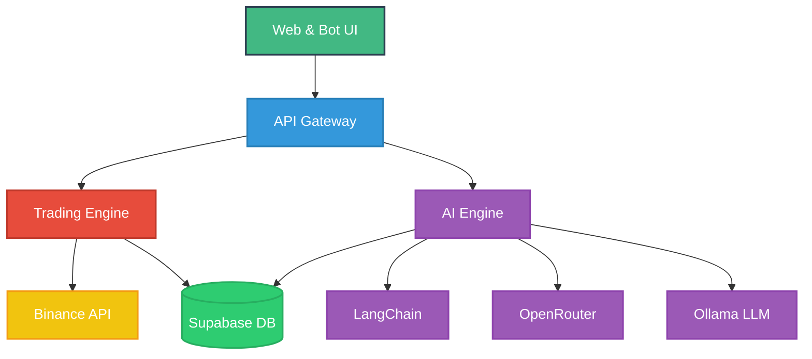

# Binance Trading Bot with AG

<div align="center">

[](https://github.com/Gmpho/ag-bot-automation-with-ag/actions)
[](https://opensource.org/licenses/MIT)
[](https://www.python.org/downloads/)
[](https://fastapi.tiangolo.com)
[](https://github.com/psf/black)

**AI-Powered Trading Bot for Binance | Built with Modern Tech Stack**

[Demo](https://your-demo-link.com) · [Documentation](docs/) · [Report Bug](issues) · [Request Feature](issues)

</div>

---

## 🎯 Overview

> A modern, AI-powered trading bot that automates Binance spot trading with advanced risk management and multi-platform control.

### Key Capabilities

- 🤖 **Smart Trading**: AI-driven trade decisions using LangChain + Ollama
- 📱 **Multi-Platform**: Access via Web, Telegram, or Discord
- 🔒 **Enterprise Security**: Role-based access with Supabase
- 💳 **Monetization Ready**: Built-in Stripe subscription system
- 📊 **Real-time Analytics**: Live trading insights and reporting

An advanced Binance trading bot that leverages artificial intelligence for automated trading strategies:

- **Core**: Binance Spot micro-trading bot with dip-buy & gain-sell logic
- **Interface**: Multi-platform control via Web UI, Telegram & Discord
- **AI Integration**: LangChain + OpenRouter + Ollama LLM for smart decisions
- **Security**: Role-based access control with Supabase authentication
- **Payments**: Stripe integration for subscription management
- **Deployment**: Automated CI/CD with GitHub Actions & Fly.io

## ✨ Features Showcase

### 📈 Smart Trading Dashboard

- Real-time market data visualization
- AI-powered trade suggestions
- Portfolio performance tracking
- Risk analysis metrics

### 🤖 AI-Powered Analysis

- Market sentiment analysis
- Pattern recognition
- Risk assessment
- Automated trading signals

### 📱 Multi-Platform Access

- Web dashboard
- Telegram bot interface
- Discord integration
- Mobile responsiveness

### 💼 Professional Tools


- Advanced order types
- Custom trading strategies
- Portfolio rebalancing
- Performance analytics

## 🔌 Integrations

### 📚 Notion Workspace

Our Notion integration provides seamless documentation and analytics:

- Real-time trade logging and performance tracking
- System documentation and team collaboration
- Automated reporting and analytics dashboards
- Custom templates for various use cases

#### Available Templates

- Trading Journal Dashboard
- Performance Analytics
- System Documentation Hub
- Team Collaboration Space

#### Integration Setup

```env
# Notion API Configuration
NOTION_API_KEY=secret_...
NOTION_DATABASE_ID=your_database_id
NOTION_WORKSPACE_ID=your_workspace_id
```

#### Usage Example

```python
from core.notion import NotionSync

# Auto-sync trading results
notion = NotionSync()
notion.update_trading_journal(trade_results)

# Update system documentation
notion.sync_documentation(new_docs)
```

### 🔄 Other Integrations

- **Discord**: Real-time alerts and trading commands
- **Telegram**: Mobile trading and notifications
- **Binance API**: Direct trading interface
- **Supabase**: Secure data storage
- **Stripe**: Payment processing

## 🏗 Architecture

### System Architecture



_Each color represents a different system layer: 🟢 Frontend, 🔵 Backend, 🔴 Core, 🟣 AI, 🟡 External, 🟢 Database_

### Project Structure

| Directory | Content | Description |
|-----------|---------|-------------|
| `apps/` | Frontend & Backend | Application components |
| └─ `web/` | Next.js | User interface and dashboard |
| └─ `api/` | FastAPI | Backend API services |
| └─ `bots/` | Python | Telegram & Discord bots |
| `core/` | Trading Logic | Core business logic |
| └─ `trading/` | Python | Trading algorithms |
| └─ `ai/` | LangChain | AI components & models |
| └─ `security/` | Python | Auth & encryption |
| `deploy/` | DevOps | Deployment configurations |
| └─ `docker/` | Dockerfile | Container configurations |
| └─ `fly/` | Fly.io | Cloud deployment settings |
| `scripts/` | Python | Helper scripts & utilities |

## 🛠 Tech Stack

| Category | Technologies |
|----------|-------------|
| Frontend | Next.js, TailwindCSS, React Query |
| Backend | Python, FastAPI, WebSocket |
| Database | Supabase (PostgreSQL) |
| AI/ML | LangChain, OpenRouter, Ollama |
| DevOps | Docker, GitHub Actions, Fly.io |
| Documentation | Notion API, Auto-sync |
| Monitoring | Custom Logging, Metrics |
| Payment | Stripe |

## 📥 Installation

1. **Clone Repository**
   \`\`\`bash
   git clone https://github.com/Gmpho/ag-bot-automation-with-ag.git
   cd ag-bot-automation-with-ag
   \`\`\`

2. **Install Dependencies**
   \`\`\`bash
   # Backend
   python -m venv venv
   source venv/bin/activate  # or .\venv\Scripts\activate on Windows
   pip install -r requirements.txt

   # Frontend
   cd apps/web
   npm install
   \`\`\`

3. **Environment Setup**
   \`\`\`bash
   cp .env.example .env
   # Configure your environment variables
   \`\`\`

## ⚙️ Configuration

### 🔑 API Keys & Secrets

```env
# Binance API Configuration
BINANCE_API_KEY=your_api_key
BINANCE_API_SECRET=your_api_secret

# Database Configuration
SUPABASE_URL=https://your-project.supabase.co
SUPABASE_KEY=your-anon-key
SUPABASE_SERVICE_KEY=your-service-key

# Payment Processing
STRIPE_SECRET_KEY=sk_test_...
STRIPE_WEBHOOK_SECRET=whsec_...

# AI Services
OPENROUTER_API_KEY=your_key
OLLAMA_HOST=http://localhost:11434

# Notion Integration
NOTION_API_KEY=secret_your_key_here
NOTION_DATABASE_ID=your_database_id
NOTION_WORKSPACE_ID=your_workspace_id

# Notion Integration
NOTION_API_KEY=secret_your_key_here
NOTION_DATABASE_ID=your_database_id
NOTION_WORKSPACE_ID=your_workspace_id
```

### 📊 Trading Configuration

```yaml
# config/trading.yml
trading:
  risk_management:
    max_position_size: 1000 USDT
    stop_loss_percentage: 2.5
    take_profit_percentage: 5
    max_open_trades: 3
    
  strategy:
    timeframe: 5m
    indicators:
      - type: RSI
        period: 14
        overbought: 70
        oversold: 30
      - type: MACD
        fast_period: 12
        slow_period: 26
        signal_period: 9

  notifications:
    telegram_enabled: true
    discord_enabled: true
    email_enabled: false
```

### 🤖 AI Configuration

```yaml
# config/ai.yml
ai_settings:
  language_model:
    provider: ollama
    model: llama2
    temperature: 0.7
    max_tokens: 500
    
  risk_analysis:
    confidence_threshold: 0.8
    min_data_points: 1000
    update_frequency: 5m
```

### 📱 Notification Settings

```yaml
# config/notifications.yml
notifications:
  telegram:
    bot_token: your_bot_token
    chat_id: your_chat_id
    alert_levels: [INFO, WARNING, ERROR]
    
  discord:
    webhook_url: your_webhook_url
    role_id: your_role_id
    channels:
      trades: channel_id
      alerts: channel_id
      system: channel_id
```

## 🚀 Usage

### Web Dashboard

1. Start the frontend: \`npm run dev\`
2. Start the backend: \`python main.py\`
3. Access at \`[http://localhost:3000](http://localhost:3000)\`

### Telegram Bot

- Start: \`python bots/telegram/main.py\`
- Commands:
  - \`/start\` - Initialize bot
  - \`/status\` - Check account status
  - \`/trade\` - View active trades

### Discord Bot

- Start: \`python bots/discord/main.py\`
- Available in your Discord server after setup

## 👩‍💻 Development

### Local Development

1. Start local services:

   ```bash
   docker-compose up -d
   ```

2. Run migrations:

   ```bash
   supabase db push
   ```

3. Start development servers:

   ```bash
   # Development servers
   npm run dev        # Frontend
   uvicorn main:app --reload  # Backend
   ```

## 🧪 Testing

Run the test suite:

```bash
# Run all tests
pytest

# Run specific test categories
pytest tests/trading/
pytest tests/ai/
```

## 📤 Deployment

1. **Build containers:**
   \`\`\`bash
   docker build -t ag-bot .
   \`\`\`

2. **Deploy to Fly.io:**
   \`\`\`bash
   fly deploy
   \`\`\`

## 🔒 Security Features

- JWT-based authentication
- Role-based access control
- API rate limiting
- Input validation
- Secure webhook handling
- Encrypted credentials

## 🤝 Contributing

1. Fork the repository
2. Create your feature branch
3. Commit your changes
4. Push to the branch
5. Create a Pull Request

## � Troubleshooting

### Common Issues

#### API Connection Issues

```bash
# Check API connectivity
curl -v https://api.binance.com/api/v3/ping

# Verify API keys
python scripts/verify_api_keys.py
```

#### Database Connection

```bash
# Test Supabase connection
supabase test db
# or
curl -v "${SUPABASE_URL}/rest/v1/" -H "apikey: ${SUPABASE_KEY}"
```

#### AI Model Issues

```bash
# Verify Ollama status
curl http://localhost:11434/api/tags

# Check model availability
python scripts/check_models.py
```

### Error Solutions

| Error | Solution |
|-------|----------|
| `BinanceAPIException: Invalid API key` | Regenerate API keys in Binance dashboard |
| `Database connection failed` | Check VPN/firewall settings and Supabase status |
| `MODEL_NOT_FOUND` | Run `ollama pull llama2` to download the model |
| `WebSocket connection failed` | Check network connectivity and port availability |

### Performance Optimization

- Enable debug logging: `LOG_LEVEL=debug python main.py`
- Monitor system resources: `docker stats ag-bot`
- Check trading latency: `python scripts/latency_test.py`
- Optimize database queries: `supabase db diagnose`

## �📄 License

This project is licensed under the MIT License - see the [LICENSE](LICENSE) file for details.

---

## 📞 Support

- Create an issue for bug reports
- Join our [Discord community](https://discord.gg/your-invite)
- Email: [support@yourproject.com](mailto:support@yourproject.com)

---

Built with 💻 by AG Team
